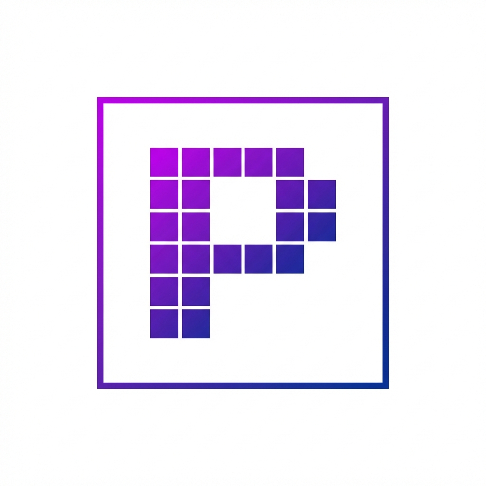

<p align="center">
  
</p>

<h1 align="center">Pixelcraft - Design Studio</h1>

A powerful, browser-based design studio for creating collages, editing images, and exporting high-quality designs. Built with React, TypeScript, and Fabric.js.


## 🌐 Live Demo

**[https://canva-collage-maker.web.app](https://canva-collage-maker.web.app)**

## ✨ Features

- 🖼️ **Collage Maker** - Create beautiful photo collages with customizable layouts
- 🎨 **Image Editor** - Adjust brightness, contrast, saturation, apply filters (grayscale, sepia)
- 📐 **Canvas Controls** - Pan, zoom, and navigate with an intuitive interface
- 🔲 **Border Customization** - Add borders to canvas and individual collage items
- 📤 **Export Options** - Export as PNG, JPEG, WebP, or SVG with resolution scaling (1x, 2x, 4x, custom)
- 💾 **Project Management** - Save/load projects as JSON files
- 🌓 **Dark/Light Theme** - Toggle between dark and light modes
- 📱 **Responsive Design** - Works on desktop and tablet devices

## 🛠️ Tech Stack

| Technology        | Purpose                 |
| ----------------- | ----------------------- |
| React 19          | UI Framework            |
| TypeScript        | Type Safety             |
| Vite              | Build Tool & Dev Server |
| Fabric.js         | Canvas Manipulation     |
| MUI (Material-UI) | Component Library       |
| Playwright        | E2E Testing             |
| Vitest            | Unit Testing            |
| Firebase Hosting  | Deployment              |

## 🚀 Getting Started

### Prerequisites

- Node.js 18+
- npm or yarn

### Installation

1. **Clone the repository**

   ```bash
   git clone https://github.com/iKrishnaSahu/canva-clone.git
   cd canva-clone
   ```

2. **Install dependencies**

   ```bash
   npm install
   ```

3. **Start the development server**

   ```bash
   npm start
   ```

4. **Open in browser**
   ```
   http://localhost:5173
   ```

## 📜 Available Scripts

| Command                  | Description                        |
| ------------------------ | ---------------------------------- |
| `npm start`              | Start development server with HMR  |
| `npm run build`          | Build for production               |
| `npm run preview`        | Preview production build locally   |
| `npm run lint`           | Run ESLint                         |
| `npm run test`           | Run Playwright E2E tests           |
| `npm run test:ui`        | Run Playwright tests with UI       |
| `npm run test:unit`      | Run Vitest unit tests              |
| `npm run deploy`         | Build and deploy to Firebase       |
| `npm run deploy:preview` | Deploy to Firebase preview channel |

## 📁 Project Structure

```
src/
├── components/          # Shared UI components
│   ├── Header.tsx       # App header with save/load/export
│   └── ExportModal.tsx  # Export settings modal
├── context/             # React context providers
│   ├── CanvasContext.tsx
│   └── ThemeContext.tsx
├── features/            # Feature modules
│   ├── collage/         # Collage templates & panel
│   └── editor/          # Canvas editor & toolbar
├── services/            # Business logic services
│   └── CollageService.ts
└── main.tsx             # App entry point
```

## 🧪 Testing

### Unit Tests

```bash
npm run test:unit
```

### E2E Tests

```bash
npm run test
```

### E2E Tests with UI

```bash
npm run test:ui
```

## 🌐 Deployment

The app is deployed on Firebase Hosting. To deploy your own instance:

1. **Install Firebase CLI**

   ```bash
   npm install -g firebase-tools
   ```

2. **Login to Firebase**

   ```bash
   firebase login
   ```

3. **Deploy**
   ```bash
   npm run deploy
   ```

## 📄 License

This project is licensed under the [MIT License](LICENSE).

---

Made with ❤️ by [Krishna Sahu](https://github.com/iKrishnaSahu)
